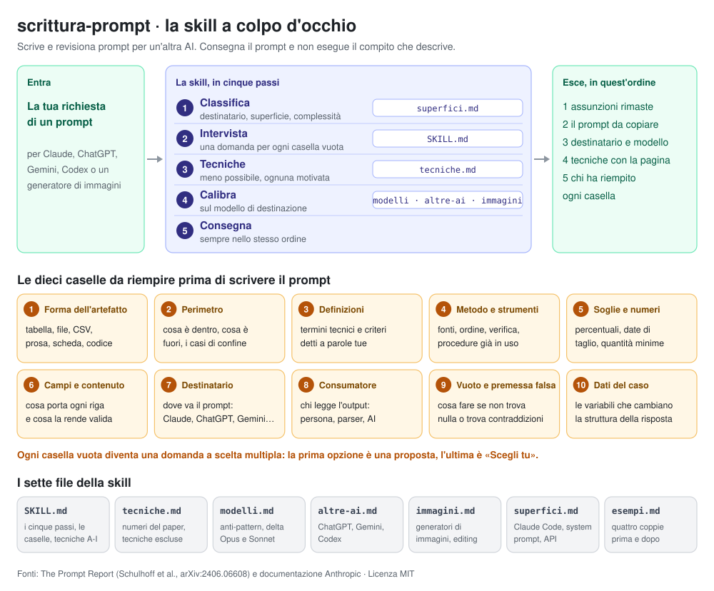
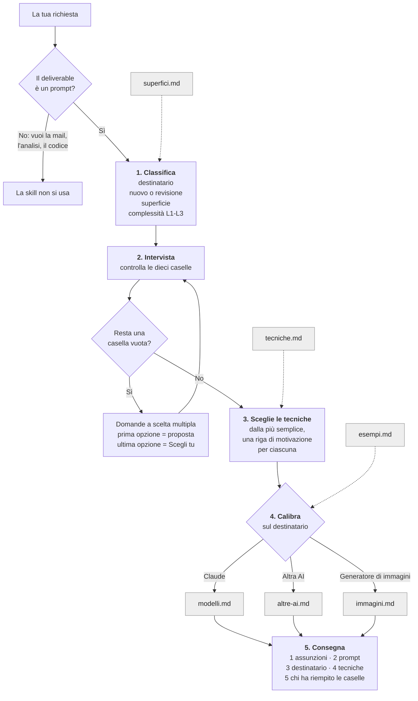

[English](README.md) · **Italiano**

# scrittura-prompt — una skill per scrivere prompt con Claude



Una skill per claude.ai che **scrive e revisiona prompt** da incollare in un'altra sessione di AI: Claude, Claude Code, ChatGPT, Codex, Gemini o un generatore di immagini. Consegna il prompt e **non** esegue il compito che il prompt descrive.

- **Chiede invece di assumere**: prima di scrivere il prompt dieci caselle devono essere piene, e ogni casella vuota diventa una domanda a scelta multipla.
- Aggiunge **meno tecniche possibile**, ciascuna col fallimento che corregge e la pagina del paper da cui viene.
- **Calibra** il prompt sul destinatario: nel dettaglio per Claude Opus 5 e Sonnet 5, con uno strato più sottile per le altre AI testuali e per i generatori di immagini.
- Elenca le assunzioni rimaste **prima** del prompt, così le correggi prima di copiarlo.

## Come funziona

Cinque passi, sempre in quest'ordine. I riquadri grigi sono i file che Claude apre in quel passo.



**Le dieci caselle del Passo 2.** Una casella è piena solo se il valore viene dalle tue parole, da un file del progetto, dalla tua memoria o dal profilo, o dalla risposta a una domanda già fatta. Un valore che l'AI saprebbe scegliere da sola non conta: è proprio il caso in cui la domanda serve.

| # | Casella | # | Casella |
|---|---|---|---|
| 1 | Forma dell'artefatto (tabella, file, prosa…) | 6 | Campi e contenuto |
| 2 | Perimetro del compito | 7 | Destinatario, modello e superficie |
| 3 | Definizioni di dominio | 8 | Consumatore dell'output |
| 4 | Metodo e strumenti che hai già | 9 | Vuoto e premessa falsa |
| 5 | Soglie e numeri | 10 | Dati del caso |

Puoi fermare l'intervista dicendolo in modo esplicito («non farmi domande»): le assunzioni vanno allora in testa alla consegna. «Dammi solo il prompt» non la ferma: vuol dire «non eseguire il compito».

Questo diagramma e la scheda in cima alla pagina sono disponibili anche come immagini, in italiano e in inglese, in [`diagrams/`](diagrams/).

## Esempio

Una sessione reale su claude.ai, anonimizzata: **[leggi il caso di studio completo](case-studies/analytical-balance-it.md)**, con il ragionamento, tutte le undici domande con le loro opzioni e la consegna per intero.

> **Richiesta:** Scrivimi un prompt per Claude che mi aiuti a preparare una procedura per la verifica periodica di una bilancia analitica in laboratorio

La skill legge la memoria dell'utente, poi fa undici domande in tre blocchi. Il primo blocco:

| Domanda | Opzioni (in grassetto quella scelta) |
|---|---|
| Dove incollerai il prompt? | **Claude, chat** · Claude Code · Altra AI |
| Quale modello Claude userai? | **Opus** · Sonnet · Non so |
| In che forma deve uscire la procedura? | SOP + modulo registrazione · **Solo testo SOP** · Solo modulo/checklist · Decidi tu |
| Quali controlli rientrano nella verifica periodica? | Giornaliero + periodico · **Solo periodico completo** · Includi gestione taratura · Decidi tu |

Poi consegna le assunzioni rimaste, un prompt in cinque sezioni con tag (contesto, dati del caso, compito, prima di scrivere, formato), il destinatario, le tecniche con la pagina del paper, e chi ha riempito ogni casella.

## Struttura della skill

```
scrittura-prompt/         skill italiana (questo README)
├── SKILL.md
├── tecniche.md
├── modelli.md
├── altre-ai.md
├── immagini.md
├── superfici.md
├── esempi.md
└── LICENSE.txt
writing-prompts/          skill inglese, stessa struttura con i nomi tradotti (vedi README.md)
zip/                      gli zip dell'ultima versione, uno per lingua
diagrams/                 il diagramma di flusso come immagine, in inglese e in italiano
case-studies/             una sessione reale, anonimizzata, in inglese e in italiano
```

| File | Quando lo apre Claude | Cosa contiene |
|---|---|---|
| [`SKILL.md`](scrittura-prompt/SKILL.md) | Sempre, appena la skill si attiva | I cinque passi, le dieci caselle, le nove tabelle di tecniche (famiglie A-I) con le pagine, i segnali d'allarme |
| [`tecniche.md`](scrittura-prompt/tecniche.md) | Quando una tecnica ha bisogno della motivazione quantitativa | I numeri del paper, le sei decisioni di progetto sugli esemplari, le tecniche escluse e perché, paper contro documentazione Anthropic |
| [`modelli.md`](scrittura-prompt/modelli.md) | Prima di consegnare un prompt per Claude | Gli anti-pattern da togliere, i delta di Opus 5 e Sonnet 5 |
| [`altre-ai.md`](scrittura-prompt/altre-ai.md) | Prima di consegnare un prompt per ChatGPT, Codex, Gemini… | Struttura proporzionata, grounding, verifica incrociata, anti-pattern |
| [`immagini.md`](scrittura-prompt/immagini.md) | Quando il prompt genera o modifica un'immagine | Le dieci caselle lette per un'immagine, le tecniche per immagini, le condizioni per funzione del generatore |
| [`superfici.md`](scrittura-prompt/superfici.md) | Per Claude Code, system prompt riutilizzabili e chiamate API | I blocchi specifici di ogni superficie |
| [`esempi.md`](scrittura-prompt/esempi.md) | Nelle revisioni | Quattro coppie prima/dopo, una per superficie |
| [`LICENSE.txt`](scrittura-prompt/LICENSE.txt) | Mai: è per le persone | La licenza MIT, perché viaggi dentro lo zip |

Le nove tabelle di tecniche stanno dentro `SKILL.md` di proposito: quando erano in un file separato, Claude lo apriva una volta su due o tre, e i prompt pescavano solo dalla prima famiglia.

## Download e installazione

Dall'[ultima release](../../releases/latest) scarica **uno** zip:

| Lingua | File | Nome della skill |
|---|---|---|
| Inglese | `writing-prompts-<versione>.zip` | `writing-prompts` |
| Italiano | `scrittura-prompt-<versione>.zip` | `scrittura-prompt` |

1. Controlla che nelle impostazioni di claude.ai sia attiva l'esecuzione del codice.
2. Apri **Customize > Skills** e fai clic su **Upload skill**.
3. Scegli lo zip, senza decomprimerlo.
4. Per una versione nuova carica il nuovo zip: sostituisce la skill con lo stesso nome.

La skill si apre da sola quando chiedi un prompt («scrivimi un prompt per…», «fammi un prompt per ChatGPT»).

## Stato

La versione **italiana** è sviluppata e collaudata sul campo con Claude Opus 5, nell'uso reale e non su benchmark sintetici. La versione **inglese** è una traduzione; finora ha una sessione sul campo, il [caso di studio](case-studies/analytical-balance-it.md).

## Versioni

Ogni release porta le due lingue allo stesso numero di versione. Gli zip stanno nella [pagina delle release](../../releases).

- **1.54** — licenza MIT: `LICENSE.txt` dentro ogni skill, `license` e `author` nel frontmatter.
- **1.53** — si aggiunge la traduzione inglese; tolti i riferimenti a skill private.

Prima della pubblicazione la skill è passata per diciassette versioni. In breve:

- **1.0** — prima stesura, ricavata da *The Prompt Report*.
- **1.1–1.3** — l'intervista diventa il default; i metodi esistenti si citano invece di reinventarli; la forma dell'output si chiede per prima.
- **1.4** — una skill sola per ogni destinatario: Claude, altre AI, generatori di immagini.
- **1.41–1.43** — una domanda per ogni casella vuota, senza tetto; il setaccio dei numeri; la decima casella, i dati del caso.
- **1.44–1.47** — regole legate al modello a cui si applicano; immagini allineate alle dieci caselle; l'ordine della consegna; un `SKILL.md` più leggero.
- **1.48–1.51** — il modello si chiede con opzioni fisse; la description è riscritta perché la skill si attivi in modo affidabile (la 1.50 è stata ritirata dopo il collaudo sul campo).
- **1.52** — le domande sempre con lo strumento di domanda interattivo.

## Segnalazioni

Hai trovato un problema? Apri una [issue](../../issues) con la richiesta che hai fatto, il modello che hai usato e cosa è andato storto. Le due segnalazioni più utili sono una scelta che spettava a te ma è stata presa senza chiedertela, e una domanda che non serviva.

## Come citarla

Se usi la skill in un tuo lavoro, citala così:

> Beretta, R. (2026). *writing-prompts / scrittura-prompt: a prompt-writing skill for Claude* (Version 1.54). https://github.com/Apsion9231/writing-prompts

Il pulsante **Cite this repository**, a destra nella pagina del repository, dà la stessa citazione in APA e BibTeX. Cita anche *The Prompt Report* (sotto), su cui la skill è costruita.

## Fonti

### Letteratura scientifica

La skill è costruita su una sola rassegna, letta per intero; gli altri lavori che nomina sono citati attraverso questa.

- Schulhoff, S., Ilie, M., Balepur, N., et al. (2025). *The Prompt Report: A Systematic Survey of Prompt Engineering Techniques*. arXiv:2406.06608v6. https://arxiv.org/abs/2406.06608
  — la tassonomia delle tecniche, i loro costi e l'evidenza. Ogni `p. N` della skill rimanda a una pagina di questa versione.

### Documentazione tecnica

Il comportamento dei modelli attuali. Consultata a settembre 2026; pagine e date esatte sono in fondo a ogni file.

- Anthropic, guide al prompt engineering: [best practice](https://platform.claude.com/docs/en/build-with-claude/prompt-engineering/claude-prompting-best-practices), [Claude Opus 5](https://platform.claude.com/docs/en/build-with-claude/prompt-engineering/prompting-claude-opus-5), [Claude Sonnet 5](https://platform.claude.com/docs/en/build-with-claude/prompt-engineering/prompting-claude-sonnet-5).
- Guide al prompting di OpenAI e Google, per le altre AI (`altre-ai.md`).
- Guide al prompting per immagini di OpenAI, Google, Black Forest Labs e Ideogram, per i generatori di immagini (`immagini.md`).

Dove il paper e la documentazione Anthropic non concordano, la documentazione vince su come si comporta il modello, il paper su cosa fa una tecnica e quanto costa.

## Licenza

© 2026 Riccardo Beretta. Distribuita con [licenza MIT](LICENSE): puoi usarla, copiarla, modificarla e distribuirla, anche a scopo commerciale, purché l'avviso di copyright e il testo della licenza restino in ogni copia. Ogni cartella di skill contiene il suo `LICENSE.txt`, così l'avviso viaggia dentro lo zip.
