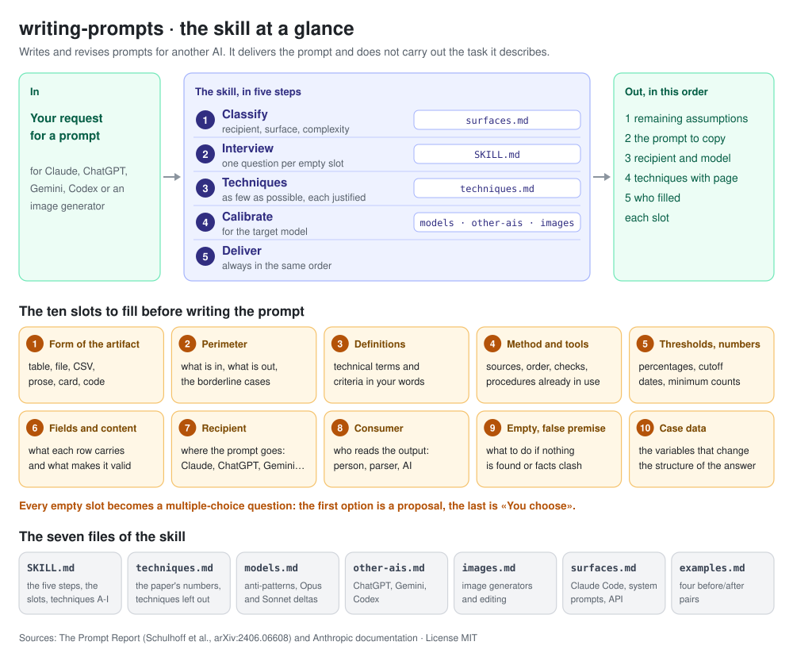
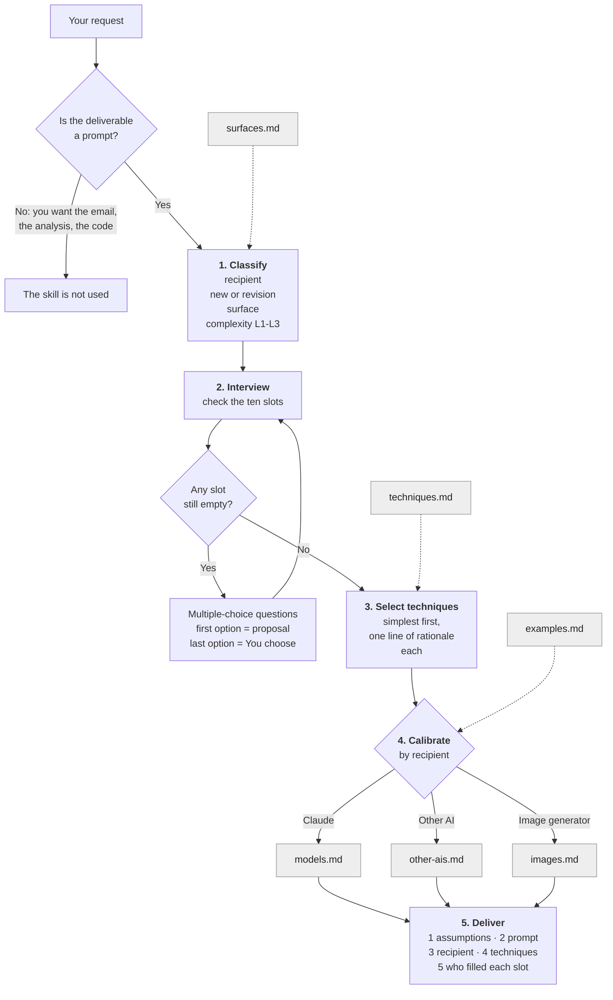

**English** · [Italiano](README.it.md)

# writing-prompts — a prompt-writing skill for Claude



A skill for claude.ai that **writes and revises prompts** to paste into another AI session: Claude, Claude Code, ChatGPT, Codex, Gemini or an image generator. It delivers the prompt and does **not** carry out the task the prompt describes.

- It **asks instead of assuming**: ten slots must be filled before the prompt is written, and every empty slot becomes a multiple-choice question.
- It adds **as few techniques as possible**, each with the failure it corrects and the page of the paper it comes from.
- It **calibrates** the prompt for the recipient: in detail for Claude Opus 5 and Sonnet 5, with a thinner layer for other text AIs and for image generators.
- It lists the assumptions that remain **before** the prompt, so you can correct them before copying it.

## How it works

Five steps, always in this order. The grey boxes are the files Claude opens at that step.



**The ten slots of Step 2.** A slot is full only if the value comes from your words, a project file, your memory or profile, or the answer to a question already asked. A value the AI could reasonably choose does not count: that is exactly when the question is needed.

| # | Slot | # | Slot |
|---|---|---|---|
| 1 | Form of the artifact (table, file, prose…) | 6 | Fields and content |
| 2 | Perimeter of the task | 7 | Recipient, model and surface |
| 3 | Domain definitions | 8 | Consumer of the output |
| 4 | Method and tools you already have | 9 | Empty result and false premise |
| 5 | Thresholds and numbers | 10 | Case data |

You can stop the interview by saying so explicitly («no questions»): the assumptions then go at the top of the delivery. «Just give me the prompt» does not stop it: it means «don't carry out the task».

This flowchart and the overview at the top of the page are also available as images, in English and Italian, in [`diagrams/`](diagrams/).

## Example

A real session on claude.ai, anonymized: **[read the full case study](case-studies/analytical-balance-en.md)**, with the reasoning, all eleven questions with their options, and the complete delivery.

> **Request:** Write me a prompt for Claude to help me prepare a procedure for the periodic verification of an analytical balance in the laboratory

The skill reads the user's memory, then asks eleven questions in three blocks. The first block:

| Question | Options (chosen in bold) |
|---|---|
| Where will you paste the prompt? | **Claude, chat** · Claude Code · Another AI |
| Which Claude model will you use? | **Opus** · Sonnet · Don't know |
| What form should the procedure take? | SOP + record form · **SOP text only** · Form/checklist only · You decide |
| Which checks are part of the periodic verification? | Daily + periodic · **Full periodic only** · Include calibration management · You decide |

Then it delivers the remaining assumptions, a prompt in five tagged sections (context, case data, task, before writing, format), the recipient, the techniques with their page in the paper, and who filled each slot.

## Structure of the skill

```
writing-prompts/          English skill (this README)
├── SKILL.md
├── techniques.md
├── models.md
├── other-ais.md
├── images.md
├── surfaces.md
├── examples.md
└── LICENSE.txt
scrittura-prompt/         Italian skill, same structure (see README.it.md)
zip/                      the zips of the latest version, one per language
diagrams/                 the flowchart as an image, English and Italian
case-studies/             a real session, anonymized, in English and Italian
```

| File | When Claude opens it | What it contains |
|---|---|---|
| [`SKILL.md`](writing-prompts/SKILL.md) | Always, as soon as the skill triggers | The five steps, the ten slots, the nine technique tables (families A-I) with page references, the red flags |
| [`techniques.md`](writing-prompts/techniques.md) | When a technique needs its quantitative rationale | The paper's numbers, the six design decisions about exemplars, the techniques left out and why, paper vs Anthropic documentation |
| [`models.md`](writing-prompts/models.md) | Before delivering a prompt for Claude | Anti-patterns to remove, the Opus 5 and Sonnet 5 deltas |
| [`other-ais.md`](writing-prompts/other-ais.md) | Before delivering a prompt for ChatGPT, Codex, Gemini… | Proportionate structure, grounding, cross-checking, anti-patterns |
| [`images.md`](writing-prompts/images.md) | When the prompt generates or edits an image | The ten slots read for an image, image techniques, conditions per generator feature |
| [`surfaces.md`](writing-prompts/surfaces.md) | For Claude Code, reusable system prompts and API calls | The blocks specific to each surface |
| [`examples.md`](writing-prompts/examples.md) | On revisions | Four before/after pairs, one per surface |
| [`LICENSE.txt`](writing-prompts/LICENSE.txt) | Never: it is for people | The MIT license, so that it travels inside the zip |

The nine technique tables sit inside `SKILL.md` on purpose: when they were in a separate file, Claude opened it one time in two or three, and the prompts drew from the first family only.

## Download and install

From the [latest release](../../releases/latest), download **one** zip:

| Language | File | Skill name |
|---|---|---|
| English | `writing-prompts-<version>.zip` | `writing-prompts` |
| Italian | `scrittura-prompt-<version>.zip` | `scrittura-prompt` |

1. Make sure code execution is enabled in your claude.ai settings.
2. Open **Customize > Skills** and click **Upload skill**.
3. Choose the zip, without unzipping it.
4. For a new version, upload the new zip: it replaces the skill with the same name.

The skill opens on its own when you ask for a prompt («write me a prompt to…», «draft a prompt for ChatGPT»).

## Status

The **Italian** version is developed and field-tested on Claude Opus 5, in real use rather than synthetic benchmarks. The **English** version is a translation; it has one field session so far, the [case study](case-studies/analytical-balance-en.md).

## Versions

Each release carries both languages at the same version number. The [releases page](../../releases) has the zips.

- **1.54** — MIT license: `LICENSE.txt` inside each skill, `license` and `author` in the frontmatter.
- **1.53** — the English translation is added; references to private skills are removed.

Before going public, the skill went through seventeen versions. In brief:

- **1.0** — first draft, derived from *The Prompt Report*.
- **1.1–1.3** — the interview becomes the default; existing methods are cited instead of reinvented; the form of the output is asked first.
- **1.4** — one skill for every recipient: Claude, other AIs, image generators.
- **1.41–1.43** — one question per empty slot, with no ceiling; the number sieve; the tenth slot, case data.
- **1.44–1.47** — rules scoped by model; images aligned to the ten slots; the order of the delivery; a lighter `SKILL.md`.
- **1.48–1.51** — the model is asked with fixed options; the description is rewritten so the skill triggers reliably (1.50 was withdrawn after field testing).
- **1.52** — questions always through the interactive question tool.

## Feedback

Found a problem? Open an [issue](../../issues) and include the request you made, the model you used, and what went wrong. The two most useful reports are a choice that was yours but was made without asking you, and a question that was not needed.

## How to cite

If you use the skill in your work, cite it as:

> Beretta, R. (2026). *writing-prompts / scrittura-prompt: a prompt-writing skill for Claude* (Version 1.54). https://github.com/Apsion9231/writing-prompts

The **Cite this repository** button on the right side of the repository page gives the same citation in APA and BibTeX. Please also cite *The Prompt Report* (below), on which the skill is built.

## Sources

### Scientific literature

The skill is built on one survey, read in full; the other works it mentions are cited through it.

- Schulhoff, S., Ilie, M., Balepur, N., et al. (2025). *The Prompt Report: A Systematic Survey of Prompt Engineering Techniques*. arXiv:2406.06608v6. https://arxiv.org/abs/2406.06608
  — the taxonomy of techniques, their costs and evidence. Every `p. N` in the skill refers to a page of this version.

### Technical documentation

How current models behave. Consulted in September 2026; the exact pages and dates are listed at the end of each file.

- Anthropic, prompt engineering guides: [best practices](https://platform.claude.com/docs/en/build-with-claude/prompt-engineering/claude-prompting-best-practices), [Claude Opus 5](https://platform.claude.com/docs/en/build-with-claude/prompt-engineering/prompting-claude-opus-5), [Claude Sonnet 5](https://platform.claude.com/docs/en/build-with-claude/prompt-engineering/prompting-claude-sonnet-5).
- OpenAI and Google prompting guides, for other AIs (`other-ais.md`).
- OpenAI, Google, Black Forest Labs and Ideogram image-prompting guides, for image generators (`images.md`).

Where the paper and the Anthropic documentation disagree, the documentation wins on how the model behaves, the paper on what a technique does and what it costs.

## License

© 2026 Riccardo Beretta. Released under the [MIT License](LICENSE): you may use, copy, modify and distribute it, also commercially, as long as the copyright notice and the license text stay with every copy. Each skill folder carries its own `LICENSE.txt`, so the notice travels inside the zip.
