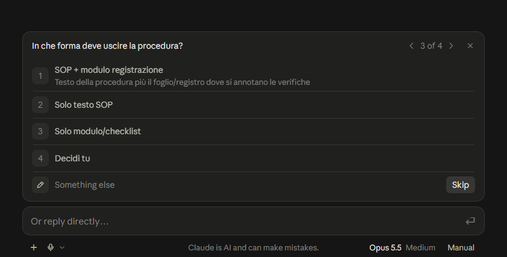
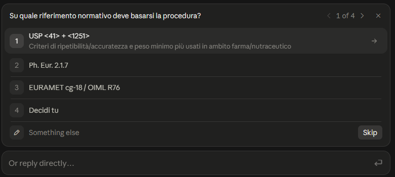

[English](analytical-balance-en.md) · **Italiano**

# Caso di studio: il prompt per una SOP di verifica della bilancia analitica

Una sessione reale su claude.ai, dalla richiesta alla consegna, riportata per intero. Serve a vedere come lavora la skill: cosa legge, cosa chiede, cosa decide e cosa consegna.

| | |
|---|---|
| Data | 3 ottobre 2026 |
| Superficie | Chat su claude.ai, fuori da qualunque progetto |
| Modello | Claude Opus 5.5, effort Medium |
| Skill | `writing-prompts` 1.53, la versione inglese. Le risposte sono in italiano perché l'account ha l'italiano come lingua preferita: la logica è la stessa di `scrittura-prompt`, di cui è la traduzione |

**Cosa è stato modificato rispetto alla sessione.** Quattro punti, anonimizzati e segnati fra parentesi quadre: il nome dell'azienda in un'opzione, il ruolo e il settore nel contesto del prompt, gli stessi dati nella riga «dal tuo profilo», i titoli delle voci di memoria. Il resto è trascritto senza ritocchi, compresi i simboli ⟨41⟩ e le formulazioni della skill. Il prompt consegnato **non è stato eseguito**: la skill consegna il prompt e si ferma lì.

---

## 1. La richiesta

> Scrivimi un prompt per Claude che mi aiuti a preparare una procedura per la verifica periodica di una bilancia analitica in laboratorio

## 2. Prima delle domande: cosa ha letto

Il riepilogo del ragionamento visibile in chat, nell'ordine:

- Loaded skill — `writing-prompts`
- Sorting out how to approach the request.
- Read memory — *[due voci della memoria dell'utente]*
- Scoping the audit checklist and required documentation.
- Listing balance specifications and reference weight requirements.
- Drafting the reusable L2 prompt structure with its question blocks

La skill si è aperta da sola sulla richiesta, ha letto la memoria dell'utente prima di chiedere, e ha classificato il compito come L2 (prompt ripetibile).

## 3. L'intervista: undici domande in tre blocchi

Le domande arrivano nel pop-up interattivo della chat. In ogni domanda, tranne le prime due, la prima opzione è la proposta della skill e l'ultima è «Decidi tu». Ogni domanda ha anche un campo libero («Something else»).



In grassetto la risposta scelta. La colonna «Casella» è una **nota del curatore**: indica quale delle dieci caselle della skill riempie la domanda.

**Blocco 1 di 3**

| # | Domanda | Opzioni | Casella |
|---|---|---|---|
| 1 | Dove incollerai il prompt? | **Claude, chat** · Claude Code · Altra AI | 7 |
| 2 | Quale modello Claude userai? | **Opus** · Sonnet · Non so | 7 |
| 3 | In che forma deve uscire la procedura? | SOP + modulo registrazione *(testo della procedura più il foglio/registro dove si annotano le verifiche)* · **Solo testo SOP** · Solo modulo/checklist · Decidi tu | 1 |
| 4 | Quali controlli rientrano nella verifica periodica? | Giornaliero + periodico *(check d'uso quotidiano (sensibilità) più verifica periodica completa (ripetibilità, accuratezza, eccentricità, linearità, peso minimo); taratura esterna esclusa)* · **Solo periodico completo** · Includi gestione taratura *(anche interfaccia con la taratura ACCREDIA esterna e gestione fuori-tolleranza)* · Decidi tu | 2 |

**Blocco 2 di 3**

| # | Domanda | Opzioni | Casella |
|---|---|---|---|
| 5 | Su quale riferimento normativo deve basarsi la procedura? | **USP &lt;41&gt; + &lt;1251&gt;** *(criteri di ripetibilità/accuratezza e peso minimo più usati in ambito farma/nutraceutico)* · Ph. Eur. 2.1.7 · EURAMET cg-18 / OIML R76 · Decidi tu | 4 |
| 6 | Chi fissa criteri di accettazione e frequenza delle verifiche? | Dalla norma scelta *(Claude li ricava dal riferimento normativo e li cita, senza inventarne)* · Li fornisco io *(nel prompt metterò segnaposto da compilare)* · Tolleranze costruttore · **Decidi tu** | 5 |
| 7 | Che struttura deve avere la SOP? | Struttura SOP [aziendale] *(scopo, campo, responsabilità, riferimenti, definizioni, materiali, procedura, criteri, azioni in caso di non conformità, registrazioni)* · **Struttura libera** · Te la incollo io · Decidi tu | 6 |
| 8 | Chi leggerà la SOP? | **Tecnici + QA** *(eseguibile al banco e difendibile in audit ISO 13485)* · Solo QA/audit · Solo uso interno mio · Decidi tu | 8 |



**Blocco 3 di 3**

| # | Domanda | Opzioni | Casella |
|---|---|---|---|
| 9 | Se a Claude manca un dato o trova un conflitto con la norma, cosa deve fare? | **Chiede prima di scrivere** *(elenca le domande, poi redige)* · Segnaposto [DA DEFINIRE] *(scrive comunque e marca i punti aperti)* · Assume e dichiara · Decidi tu | 9 |
| 10 | Che bilancia è (risoluzione d)? | **Analitica d=0,1 mg** · Semimicro d=0,01 mg · Più bilance diverse · Decidi tu *(prompt generico con dati strumento come segnaposto)* | 10 |
| 11 | Che masse campione avete per le verifiche? | **Classe E2 certificate** · Classe F1 certificate · Non so / da definire · Decidi tu | 10 |

Dopo le risposte, il ragionamento visibile riporta: *Read memory, read a file — Read `models.md` — Definizione dei criteri e della frequenza per la delega.* È il file con i delta per Opus, che la skill apre prima di consegnare un prompt per Claude.

## 4. La consegna

Riportata per intero, nell'ordine in cui è arrivata.

**Assunzioni (rispondi sì/no):**

- Il "periodico completo" comprende ripetibilità, accuratezza, eccentricità, linearità e verifica del peso minimo. Esclude il check giornaliero e la gestione della taratura esterna.
- Soglie di accettazione e frequenze non sono scritte nel prompt. Claude le ricava da USP ⟨41⟩/⟨1251⟩ citando la sezione, e propone la frequenza su base di rischio. È lo slot 5 che mi hai delegato.

**Il prompt:**

```
<contesto>
Lavoro [in un laboratorio di sviluppo analitico] che opera in regime ISO 13485, non GMP. Devo redigere una SOP per la verifica periodica interna di una bilancia analitica. La verifica si colloca tra una taratura esterna e la successiva, che resta fuori da questo documento. La SOP sarà usata al banco dai tecnici e dovrà reggere un audit ISO 13485 davanti alla QA: deve essere eseguibile senza interpretazioni e ogni criterio deve essere tracciabile alla sua fonte.
</contesto>

<dati_del_caso>
- Strumento: bilancia analitica, risoluzione d = 0,1 mg
- Masse campione disponibili: classe OIML E2, con certificato
- Riferimento normativo: USP <41> Balances e USP <1251> Weighing on an Analytical Balance
</dati_del_caso>

<compito>
Redigi il testo della SOP per la verifica periodica completa della bilancia. La verifica comprende ripetibilità, accuratezza, eccentricità, linearità e determinazione o conferma del peso minimo. Il check giornaliero d'uso e la gestione della taratura esterna sono fuori perimetro: se servono come contesto, citali in una riga.

Criteri di accettazione e frequenza:
- Ricava criteri di accettazione, masse di prova e numero di pesate da USP <41>, e la frequenza delle verifiche da USP <1251>.
- Indica per ogni criterio il capitolo e la sezione da cui viene.
- Dove la norma lascia una scelta al laboratorio (frequenza, scelta delle masse, fattore di sicurezza sul peso minimo), proponi un valore motivato e marcalo come «proposta del laboratorio». In questo modo il lettore distingue ciò che è normativo da ciò che è una nostra decisione.
- Se non sei certo della formulazione della revisione vigente di un capitolo, dichiaralo nel punto specifico invece di riportare un valore come certo.

Struttura: scegli tu le sezioni. Includi però la gestione del risultato non conforme, cioè cosa fa il tecnico se un test fallisce, e i dati da registrare per ogni test.
</compito>

<prima_di_scrivere>
Se ti mancano dati necessari, o se trovi un conflitto tra quanto scritto qui e USP <41>/<1251>, fermati prima di redigere. Esempi di dati mancanti: portata massima, masse nominali effettivamente disponibili, condizioni ambientali. Elenca le domande e attendi le risposte.
</prima_di_scrivere>

<formato>
Solo il testo della SOP, in prosa tecnica con sezioni numerate. Tieni la lunghezza proporzionata a una procedura operativa: nessuna sezione introduttiva di riempimento e nessuna spiegazione teorica che il tecnico non usa al banco. Resta nel perimetro indicato: se ritieni che manchi qualcosa di importante, segnalalo in una frase alla fine invece di aggiungerlo al documento.
</formato>
```

**Destinatario:** Claude Opus, chat su claude.ai. Le tue preferenze (italiano, rigore terminologico, verifica delle fonti) restano attive nell'account, quindi non le ho ripetute. Controlla comunque i valori numerici di USP ⟨41⟩ sul testo ufficiale vigente: Claude li riporta a memoria se non fa una ricerca.

**Tecniche usate:**

- Operational definition e Scope (tab. A). La verifica è separata dalla taratura e il perimetro dei test è esplicito. Evita che Claude includa in silenzio il check giornaliero.
- Context on the goals (tab. A, p. 39). Spiega che il documento deve essere usabile dai tecnici e difendibile in audit. Da qui Claude ricava la tracciabilità dei criteri anche in casi che non ho previsto.
- Question Clarification (tab. C, p. 32). Claude si ferma prima di scrivere se mancano dati. È la tua risposta allo slot 9.
- Separazione normativo/proposta. Corregge il rischio principale: soglie inventate presentate come se fossero USP.
- Delta Opus (`models.md`):
  - vincolo di perimetro con «segnala in una frase», perché Opus tende ad allargare il compito;
  - concisione chiesta esplicitamente, perché Opus produce documenti più lunghi;
  - nessuna istruzione di auto-verifica, perché Opus la fa già e aggiungerla produce solo verifiche ridondanti.

**Slot compilati senza domanda:**

- Slot 3 (cosa si intende per "verifica periodica"): deciso dalla tua scelta di perimetro.
- Contesto ISO 13485 non GMP [e ruolo]: dal tuo profilo.
- Tutti gli altri slot: dalle tue risposte. Gli slot 5 e 6 (soglie e struttura) li hai delegati, e la scelta che ho fatto è indicata sopra.

---

## Cosa si vede in questo caso

*Nota del curatore: fatti osservabili nella sessione, senza giudizi sul prompt.*

- **L'attivazione.** Nella richiesta non c'è nessuna parola chiave oltre a «prompt», e la skill si apre da sola.
- **Le fonti prima delle domande.** Legge la memoria prima di chiedere: il contesto ISO 13485 non viene chiesto, perché è già nel profilo.
- **Una domanda per casella vuota.** Sono undici domande: la casella 7 vale due domande (destinatario e modello), la 10 due (bilancia e masse), la 3 nessuna.
- **Proposta prima, delega ultima.** Nelle domande 3-11 la prima opzione è la proposta e l'ultima è «Decidi tu». Le domande 1 e 2 hanno opzioni fisse e niente «Decidi tu», perché destinatario e modello sono fatti, non decisioni.
- **La delega finisce in ricevuta.** La casella 5 delegata («Decidi tu») compare fra le assunzioni, con la scelta fatta: soglie ricavate da USP e citate, non scritte nel prompt.
- **L'ordine della consegna.** Assunzioni, prompt, destinatario, tecniche con la pagina del paper, caselle e chi le ha riempite.
