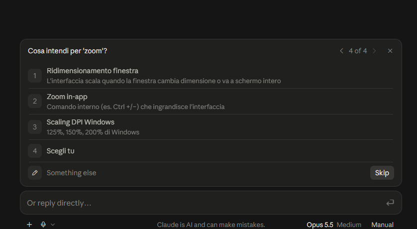
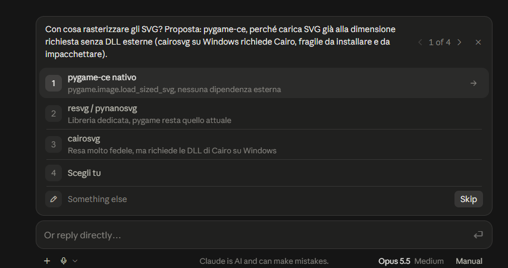

**English** · [Italiano](pygame-svg-icons-it.md)

# Case study: the prompt for moving a pygame game from PNG to SVG icons

A real claude.ai session, from request to delivery, reported in full. It shows how the skill works when the prompt is for Claude Code: what it reads, what it asks, what it decides and what it delivers.

| | |
|---|---|
| Date | 3 October 2026 |
| Surface | Chat on claude.ai, outside any project |
| Model | Claude Opus 5.5, Medium effort |
| Skill | `writing-prompts` 1.54, the English version. The request was written in English; questions and delivery came back in Italian because the account's preferred language is Italian |

**This is a translation.** The request below is the original. Everything after it — questions, options and the delivered prompt — is translated from the [Italian transcript](pygame-svg-icons-it.md). The screenshots show the original Italian interface.

**What was changed from the session.** Two points, anonymized and marked in square brackets: the titles of the memory entries that were read, and the first option of question 9, which named one of the user's projects found in memory. Everything else is reported without edits. The delivered prompt was **not run**: the skill delivers the prompt and stops there.

---

## 1. The request

> Write me a prompt for Claude Code that helps me replace the PNG icons in a pygame program with SVG icons that stay sharp at every zoom level

## 2. Before the questions: what it read

The summary of the visible reasoning in the chat, in order:

- Preparing a prompt for Claude Code.
- Loaded skill — `writing-prompts`
- Identifying the relevant project to address the request.
- Read memory — *[two of the user's memory entries]*
- Read `surfaces.md`
- Read `models.md`
- Listing clarifying questions about tools, scope, and project setup.

The skill opened on its own. Before asking anything it read the user's memory and two files: `surfaces.md`, with the rules for Claude Code, and `models.md`, with the Opus deltas.

## 3. The interview: eleven questions in three blocks

The questions arrive in the chat's interactive pop-up. Each question also has a free-text field («Something else»).



The chosen answer is in bold. The «Slot» column is a **curator's note**: it shows which of the skill's ten slots the question fills.

**Block 1 of 3**

| # | Question | Options | Slot |
|---|---|---|---|
| 1 | Which model will Claude Code run on? | **Opus** · Sonnet · Other | 7 |
| 2 | What form should the result of the Claude Code session take? | Changes + summary *(code changed in place, then a summary in Italian of what changed and why)* · Separate git branch *(work on a dedicated branch, main untouched)* · **Plan first, then code** *(it stops after the plan and waits for your OK)* · You choose | 1 |
| 3 | Which PNGs should be replaced? | UI icons only *(buttons, symbols, indicators; sprites, backgrounds and photos stay PNG)* · **All PNGs** *(every raster image in the program)* · A list I provide · You choose | 2 |
| 4 | What do you mean by 'zoom'? | Window resizing *(the interface scales when the window changes size or goes full screen)* · **In-app zoom** *(an internal command, e.g. Ctrl +/−, that enlarges the interface)* · Windows DPI scaling *(Windows 125%, 150%, 200%)* · You choose | 3 |

**Block 2 of 3**

| # | Question | Options | Slot |
|---|---|---|---|
| 5 | What should rasterize the SVGs? Proposal: pygame-ce, because it loads SVGs directly at the requested size without external DLLs (on Windows cairosvg needs Cairo, which is fragile to install and to package). | Native pygame-ce *(pygame.image.load_sized_svg, no external dependency)* · resvg / pynanosvg *(a dedicated library, pygame stays as it is)* · cairosvg *(very faithful rendering, but needs the Cairo DLLs on Windows)* · **You choose** | 4 |
| 6 | What zoom range should it cover? | 50–400% · **100–300%** · Whatever is already in the code *(Claude Code reads it from the program)* · You choose | 5 |
| 7 | The original PNGs after the migration? | Automatic fallback *(if an SVG is missing or fails to load, the PNG is used)* · **Deleted** *(SVG only, the PNGs leave the project)* · Archived in a folder *(taken out of use but kept)* · You choose | 2 |
| 8 | If an icon has no SVG, or the library won't install, what does Claude Code do? | Report and continue *(list the pending cases and finish the rest)* · Stop and ask · **Vectorize from the PNG** *(try to convert the PNG to SVG automatically)* · You choose | 9 |



After the second block the visible reasoning reads: *Weighing the risks of automatically vectorizing PNGs that are being deleted.* Then a third block arrives.

**Block 3 of 3**

| # | Question | Options | Slot |
|---|---|---|---|
| 9 | Which program is this about? | *[one of the user's projects, found in memory]* · **A pygame game** · Another project | 10 |
| 10 | Do the SVGs for the icons already exist? | **Yes, all of them** · Only some · No, none *(they all have to be produced: vectorization or redrawing)* | 10 |
| 11 | Is the program distributed as an executable? | **Yes, PyInstaller .exe** · Another packager · No, .py source only | 10 |

After the answers, the visible reasoning reads: *Checking full coverage of the game's graphic assets — Choosing the libraries for vector rendering and caching — Drafting the technical prompt in Italian for Claude Code — Defining the verification, approval and final clean-up phases.*

## 4. The delivery

Reported in full, in the order in which it arrived.

**Remaining assumptions (answer yes/no; in order of impact):**

1. Library (delegated to me): pygame-ce with load_sized_svg, which rasterizes the SVG directly at the requested size without external DLLs. It requires replacing pygame with pygame-ce in the project.
2. The size at 100% is the pixel size of the current PNGs.
3. Verification at three zoom levels (100, 200, 300%), taken from the ends and the middle of your range.
4. The PNGs are deleted only after verification, with a git commit first and your confirmation of the file list. You chose to delete them, but it remains an action that is hard to undo.
5. Vectorizing from the PNG stays a fallback only, because all the SVGs already exist. I choose the package, with a check that it exists on PyPI.

**The prompt:**

```
You are working on a game in Python/Pygame on Windows 11. Replace all the game's PNG images with the corresponding SVGs, rasterized at their actual on-screen size, so that they stay sharp at every level of the game's internal zoom (range 100–300%). Today the PNGs are enlarged as bitmaps and get blurry: the goal is for every image to be generated from the vector at the required resolution, not scaled.

<context>
- SVGs already exist for all the images: find where they are and match them to the PNGs. If a match is ambiguous, flag it in the plan.
- The game is distributed as an .exe built with PyInstaller: the solution must work in the executable too, with no DLLs to install by hand.
- The person guiding you does not write code: they read the plan and the summaries. Write in Italian, explain what each change does and why, and define technical terms the first time you use them.
</context>

<technical_approach>
- Library: pygame-ce, which with pygame.image.load_sized_svg rasterizes an SVG directly at the requested size. Check which pygame is installed and that the function exists in the available version. Switching to pygame-ce requires uninstalling pygame first, because the two packages conflict. If pygame-ce is not workable, propose an alternative in the plan and explain why, instead of silently changing course.
- The reference size at 100% is the pixel size of the current PNG. At zoom z the image is rasterized at round(base × z).
- Rasterize only when the zoom changes, never every frame. Keep a cache keyed by (image, size) and free the sizes no longer in use, so that memory and frame rate stay stable.
- Leave transparency, positions, hitboxes and anchors unchanged: change the image source, not the game logic.
- If an SVG is missing or fails to load, create it by vectorizing the PNG. First check that the chosen vectorization package exists on PyPI and is the expected one. List these images in the summary, because their quality has to be checked by eye.
</technical_approach>

<way_of_working>
1. Read the code and produce a plan: where the PNGs are loaded, how the zoom works today, which files will change, the PNG→SVG matching with the doubtful cases, the dependencies to add and the changes to the PyInstaller .spec. Then stop and wait for my approval.
2. After approval, implement. The work is limited to the migration: no refactoring, new features or comments on code you don't touch.
3. Run the game at 100%, 200% and 300% and check that every image is loaded from the SVG. Rebuild the .exe and check that it starts and shows the images.
4. Only after these checks, delete the replaced PNGs. First make sure the current state is saved in a git commit (if the project is not under git, ask me) and ask for my confirmation, showing me the list of files.
5. Delete the temporary files created for the tests.
</way_of_working>

Write one sentence before you start and give updates only for relevant findings or changes of course. Close with a short summary: outcome, files changed, vectorized images to check, and open issues.
```

**Recipient and surface:** Claude Code, Opus model. Start the session from the game's folder, so Claude Code reads the code and the PyInstaller .spec. At step 1 the plan arrives before any change. Check above all the PNG→SVG matching and the switch to pygame-ce.

**Techniques used:**

- Directive + context on the goals (family A, p. 5, 39): it explains why the PNGs get blurry, so the model works out on its own what counts as «sharp».
- Scope (family A): step 2 forbids refactoring. Opus delta from `models.md`: Opus tends to broaden the task.
- Plan-and-Solve with the plan as an artifact to approve (family D, p. 14): it answers your choice «plan first, then code».
- Claude Code blocks from `surfaces.md`:
  - no over-engineering;
  - confirmation before destructive actions (deleting the PNGs);
  - a check that packages exist on PyPI, to avoid invented or malicious names (p. 30);
  - clean-up of temporary files.
- Opus delta from `models.md`:
  - narration cadence described in positive terms;
  - a short final summary;
  - no generic instruction to «double-check». Step 3 is a test with concrete criteria, not a generic self-check.

**Slots that did not become questions:**

- Slot 8 (who reads the output): you, who don't write code. It comes from your profile, and the line about explanations in Italian follows from it. It goes into the prompt because your claude.ai preferences are not active in Claude Code.
- Slot 7 (surface): Claude Code, from your request.
- All the other slots come from your answers. The exceptions are the library and the vectorization tool, which you delegated to me: they are assumptions 1 and 5.

---

## What this case shows

*Curator's note: facts observable in the session, with no judgment on the prompt.*

- **A recipient already named is not asked again.** The request names Claude Code, so the skill asks only for the model. In the [balance case](analytical-balance-en.md), where the recipient was not named, the first two questions were recipient and model.
- **The surface changes the files read and the prompt.** Before the questions the skill opens `surfaces.md`. From it come the plan to approve, the confirmation before deleting, the PyPI check on packages and the final clean-up.
- **Memory is read, not taken for granted.** The memory held one of the user's projects that could have been the right one. The skill offers it as the first option of question 9, but asks instead of assuming it.
- **Definitions before numbers.** «Zoom» has three different meanings in a Windows program (window, internal command, DPI scaling), and question 4 pins it down before question 6 asks for the range.
- **A block born from two answers.** Answers 7 and 8 together said: delete the PNGs, and if an SVG is missing, derive it from the PNG. The skill notices the risk and opens a third block, which asks whether the SVGs already exist. With «Yes, all of them» vectorization stays a fallback (assumption 5), and the PNGs are deleted only after testing, with a git commit and a confirmation (assumption 4).
- **Facts without «You choose».** The questions of the third block are about the user's case: which program, which files exist, how it is distributed. They have no «You choose»: these are facts only the user knows.
- **Delegation ends up in the receipt.** Question 5, delegated with «You choose», comes back as assumption 1, with the choice made and its consequence: replacing pygame with pygame-ce.
- **The profile enters the prompt only when needed.** In the balance case the user's preferences were not repeated, because the chat already applies them. Here they are, because they are not active in Claude Code.
